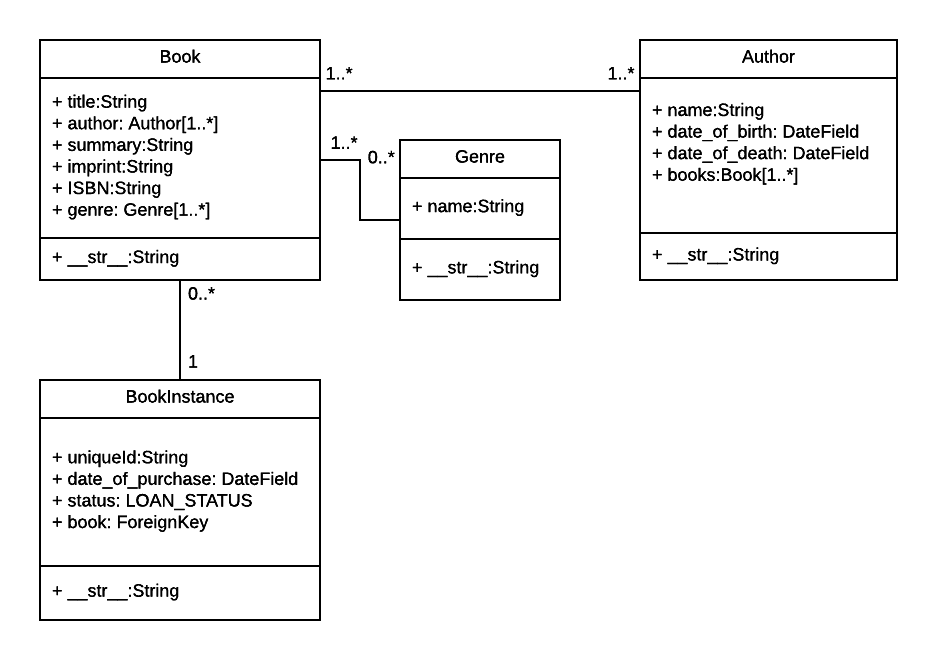

#  第九天

开始一个新项目
+ 使用django的工具创建一个网站项目和应用
+ 创建模型（models）
+ 使用django的admin站点来填充网站数据
+ 创建视图函数（views）来取回相应的数据，并用模板（templates）渲染成HTML页面
+ 创建urlconf，将不同的url分发给特定的视图函数（views）
+ 添加用户认证和会话（sessions）
+ 表单
+ 编写单元测试

## 创建一个新的项目
创建一个图书管理项目，这个网站的目标是为一个小型的图书馆提供一个在线的目录。在这个小型图书管里，用户能浏览书籍和管理他们的账户。

### 搭建网站框架
1. 使用django-admin 工具创建项目文件夹
2. 使用manager.py创建一个应用
3. 在项目配置文件（settings.py）中注册应用
4. 为应用分配url

### 创建项目
```
django-admin startproject locallibrary
cd locallibrary
```
django-admin 工具创建如下所示的目录结构
```
locallibrary/
├── locallibrary
│   ├── __init__.py
│   ├── settings.py
│   ├── urls.py
│   └── wsgi.py
└── manage.py

```
locallibrary文件夹是整个网站的进入点
+ settings.py 包含所有的网站设置。这是可以注册所有创建的应用的地方，也是静态文件，数据库配置的地方，等等
+ urls.py 定义了网站url到view的映射。虽然这里可以包含所有的url，但是更常见的做法是把应用相关的url包含在相关应用中
+ wsgi.py 帮助Django应用和web服务器间的通讯
+ manage.py 可以创建应用，操作数据库，启动开发服务器

### 创建catalog应用
接下来，在locallibrary项目里，使用下面的命令创建catalog应用
```
python manage.py startapp catalog
```
这个工具创建了一个新的文件夹，并为该应用创建了不同的文件
```
locallibrary/
├── catalog
│   ├── admin.py
│   ├── apps.py
│   ├── __init__.py
│   ├── migrations
│   │   └── __init__.py
│   ├── models.py
│   ├── tests.py
│   └── views.py
├── locallibrary
│   ├── __init__.py
│   ├── __pycache__
│   │   ├── __init__.cpython-36.pyc
│   │   └── settings.cpython-36.pyc
│   ├── settings.py
│   ├── urls.py
│   └── wsgi.py
└── manage.py
```
+ views.py 视图
+ models.py 模式
+ tests.py 测试
+ admin.py 网站管理
+ apps.py  注册应用
+ migration文件夹，用来存储“migrations”——当你修改你的数据模型时，这个文件会自动升级你的数据库。
+ __init__.py — 一个空文件，声明模块

注意：这时文件夹locallibrary下面有urls.py,应用catalog下没有urls.py,我们后面添加

### 注册catalog应用

既然应用已经创建好了，我们还必须在项目里注册它，以便工具在运行时它会包括在里面（比如在数据库里添加模型时）。在项目的settings里，把应用添加进INSTALLED_APPS ，就完成了注册。

打开项目设置文件 locallibrary/locallibrary/settings.py 找到  INSTALLED_APPS 列表里的定义。 如下所示，在列表的最后添加新的一行catalog.apps.CatalogConfig

```
INSTALLED_APPS = [
    'django.contrib.admin',
    'django.contrib.auth',
    'django.contrib.contenttypes',
    'django.contrib.sessions',
    'django.contrib.messages',
    'django.contrib.staticfiles',
    'catalog.apps.CatalogConfig', 
]
```

新的这行详细说明了应用配置文件在 (CatalogConfig) /locallibrary/catalog/apps.py 里，当你创建应用时就完成了这个过程。

注意：注意到INSTALLED_APPS已经有许多其他的应用了 (还有 MIDDLEWARE, 在settings的下面)。这些应用为  Django administration site 提供了支持和许多功能(包括会话，认证系统等)。

### 配置数据库
sqllite
```
DATABASES = {
    'default': {
        'ENGINE': 'django.db.backends.sqlite3',
        'NAME': os.path.join(BASE_DIR, 'db.sqlite3'),
    }
}
```
mysql
```
DATABASES = {
    'default': {
        'ENGINE': 'django.db.backends.mysql',
        'NAME': 'locallibrary',
        'USER': 'root',
        'PASSWORD': '',
        'HOST': '127.0.0.1',
        'PORT': '3306',
    }
}
```

注意：mysql需要安装mysqlconnect模块，并现在mysql数据库中创建出一个数据库

### 其他配置

settings.py里还包括其他的一些设置，现在只需要改变时区。
```
TIME_ZONE = 'Asia/Shanghai'
```

### 配置urlconf

打开locallibrary/locallibrary/urls.py 注意指导文字解释了一些使用URL映射器的方法。
```
"""locallibrary URL Configuration

The `urlpatterns` list routes URLs to views. For more information please see:
    https://docs.djangoproject.com/en/2.0/topics/http/urls/
Examples:
Function views
    1. Add an import:  from my_app import views
    2. Add a URL to urlpatterns:  path('', views.home, name='home')
Class-based views
    1. Add an import:  from other_app.views import Home
    2. Add a URL to urlpatterns:  path('', Home.as_view(), name='home')
Including another URLconf
    1. Import the include() function: from django.urls import include, path
    2. Add a URL to urlpatterns:  path('blog/', include('blog.urls'))
"""
from django.contrib import admin
from django.urls import path

urlpatterns = [
    path('admin/', admin.site.urls),
]

```

URL 映射通过urlpatterns 变量管理，它是一个path() 函数的Python列表。 每个path()函数要么将URL式样(URL pattern)关联到特定视图(specific view)，当模式匹配时将会显示，要么关联到某个URL式样列表函数。urlpatterns 列表最开始定义了把所有URL映射到admin.site.urls这个函数。这个函数包含了Administration 应用自己的URL映射定义。

在urlpatterns 列表的下面一行插入下面的代码。这个新的URL定义把所有的catalog式样的网络请求放在模块 catalog.urls里处理 (使用相对路径 URL /catalog/urls.py).
```
from django.conf.urls import include, url

urlpatterns += [
    path('catalog/', include('catalog.urls')),
]
```

现在我们把我们网站的根URL(例如127.0.0.1:8000)URL 127.0.0.1:8000/catalog/; 这是项目中唯一的应用，所以我们最好这样做。为了完成这个目标，我们使用一个特别的视图函数(RedirectView), 当url函数中的url式样被识别以后（在这个例子中是根url），就会把RedirectView里的第一个相对路径参数重定向到（/catalog）。

```
#Add URL maps to redirect the base URL to our application
from django.views.generic import RedirectView
urlpatterns += [
    path('', RedirectView.as_view(url='/catalog/')),
]
```

Django 默认不会提供CSS, JavaScript, 和图片等静态文件 。但是当你在开发环境中开发时，这些静态文件也很有用。在URL配置李，你可以加上下面的代码在开发环境中使用静态文件。
```
# Use static() to add url mapping to serve static files during development (only)
from django.conf import settings
from django.conf.urls.static import static

urlpatterns += static(settings.STATIC_URL, document_root=settings.STATIC_ROOT)
```

注意： 我们也可以用下面的方法
```
urlpatterns = [
    path('admin/', admin.site.urls),
    path('catalog/', include('catalog.urls')),
    path('', RedirectView.as_view(url='/catalog/', permanent=True)),
] + static(settings.STATIC_URL, document_root=settings.STATIC_ROOT)
```

在catalog文件夹里创建一个名为 urls.py 的文件, 添加下面的代码urlpatterns. 我们会在编写应用时添加相关式样。
```
from django.urls import path

from . import views


urlpatterns = [

]
```

### 测试网站框架

Django 使用对象关系映射器（ORM）将Django代码中的模型定义映射到底层数据库使用的数据结构。当我们更改模型定义时，Django会跟踪更改并创建数据库迁移脚本 (in /locallibrary/catalog/migrations/) 来自动迁移数据库中的底层数据结构

当我们创建网站时，Django会自动添加一些模型供网站的管理部分使用（稍后我们会解释）。运行以下命令来定义数据库中这些模型的表（确保你位于包含 manage.py 的目录中):

```
python manage.py makemigrations
python manage.py migrate
```
注意： 每次模型改变，都需要运行以上命令，来影响需要存储的数据结构（包括添加和删除整个模型和单个字段）

makemigrations 命令创建（但不适用）项目中安装的所有应用程序的迁移（你可以指定应用程序名称，也可以为单个项目运行迁移）
这 migrate 命令 明确应用迁移你的数据库（Django跟踪哪些已添加到当前数据库）

### 运行网站
```
python manage.py runserver
```

## 使用模型

Django Web应用程序通过被称为模型的Python对象访问和管理数据。模型定义存储数据的结构，包括字段类型以及可能还有最大大小，默认值，选择列表选项，帮助文档，表单的标签文本等。模型的定义与底层数据库无关—你可以选择其中一个作为项目设置的一部分。一旦你选择了要使用的数据库，你就不需要直接与之交谈—只需编写模型结构和其他代码，Django可以处理与数据库通信的所有繁琐工作。

## 设计LocalLibrary模型

在开始编写模型之前，花几分钟时间考虑我们需要存储的数据以及不同对象之间的关系。

我们知道，我们需要存储书籍的信息（标题，摘要，作者，语言，类别，ISBN），并且我们可能有多个副本（具有全球唯一的ID，可用性状态等）。我们可以存储更多关于作者的信息，而不仅仅是他的名字，或多个作者的相同或相似的名称。我们希望能根据书名，作者名，语言和类别对信息进行排序。

在设计模型时，为每个“对象”（相关信息组）分别设置模型时有意义的。在这种情况下，明显的对象是书籍，书籍实例和作者。。

你可以想要使用模型来表示选择列表选项（例如：选择下拉列表），不应该硬编码选项进网站—这是当所有选项面临未知或改变时候的建议。在本网站，模型的明显之处包括书籍类型（例如：科幻小说，法国诗歌等）和语言（英语，法语，日语）。

一旦我们已经决定了我们的模型和字段，我们需要考虑它们的关联性。Django允许你来定义一对一的关联（OneToOneField），一对多（ForeignKey）和多对多（ManyToManyField）。

思考一下，在网站中，我们将定义模型展示在下面UML关联图中（下图）。以上，我们创建了书的模型（书的通用细节），书的实例（系统中特定的一本书—借—有），和作者。我们也决定了个类型模型，以便通过管理界面创建／选择值。我们决定没有一个模型 BookInstance：status—我们硬编码了值（LOAN_STATUS），因为我们不希望这改变。在每个框中，你可以看到模型名称，字段名称和类型，以及方法和返回类型。

该图显示模型之间的关系，包括它们的多重性。多重性是图中的数字，显示可能存在于关系中的每个模型的数量（最大值和最小值）。例如，盒子之间的连接线显示书和类型相关。书模型中数字表明，一本书必须有一个或多个类别（尽可能多），而类型旁边的线的另一端的数字表明它可以有零个或更多的关联书


             
### 模型入门

**模型定义**

模型通常在 models.py 中定义。它们是继承自 django.db.models.Model的子类， 可以包括字段，方法和元数据。下面的代码片段展示了一个 “typical” 模型，名为 MyModelName：

```
from django.db import models

class MyModelName(models.Model):
    """
    A typical class defining a model, derived from the Model class.
    """

    # Fields
    my_field_name = models.CharField(max_length=20, help_text="Enter field documentation")
    ...

    # Metadata
    class Meta: 
        ordering = ["-my_field_name"]

    # Methods
    def get_absolute_url(self):
         """
         Returns the url to access a particular instance of MyModelName.
         """
         return reverse('model-detail-view', args=[str(self.id)])
    
    def __str__(self):
        """
        String for representing the MyModelName object (in Admin site etc.)
        """
        return self.field_name

```

**字段**

模型可以有任意数量的字段，任何类型的字段—每个字段都表示我们要存储在我们的一个数据库中的一列数据。每个数据库记录（行）将由每个字段值之一组成。我们来看看例子。

```
my_field_name = models.CharField(max_length=20, help_text="Enter field documentation")
```

上面例子中单个字段叫 my_field_name ，类型为 models.CharField—这意味着这个字段将会包含字母数字字符串。使用特定的类分配字段类型，这些类决定了用于将数据存储在数据库中的记录的类型，以及从HTML表单接收到值（即构成有效值）时使用的验证标准。字段类型还可以获取参数，进一步指定字段如何存储或可以使用。在这种情况下，我们给出字段的两个参数：
+ max_length=20 — 表示此字段中值的最大长度为20个字符的状态
+ help_text="Enter field documentation" — 提供一个帮助用户的文本标签，让用户知道当前通过HTML表单输入时要提供什么值

字段名称用于在查询和模版中引用它。字段还有一个标签，通过参数verbose_name指定，默认值为大写字段的变量名的第一个字母，并用空格 替换下划线（例如 my_field_name ->My field name ，这就是默认标签）

如果模型以表单形式呈现（例如在管理站点中），则声明字段的顺序将影响其默认顺序

**字段参数**
在大多数字段，可以使用以下常用参数
+ help_text: 提供HTML表单文本提示 (e.g. i在管理站点中)
+ verbose_name: 字段标签中可读性名称，如果没有指定性，Django将从字段名称推断默认的详细名称
+ default: 该字段的默认值。这可以是值或可调用对象，在这种情况下，每次创建新纪录时都将调用该对象。
+ null: 如果是True，Django将 NULL 在数据库中存储适合的字段（一个CharField将代替一个空字符串）的空值。默认是False
+ blank: 如果True，表单中的字段被允许为空白。默认是False，这意味着表单的字段不可以未空。一般设置为NULL=True，因为如果要允许空值，你还希望数据库能够适当地表示它们。
+ choices: 这是一组字段选项。如果提供这一项，默认对应的表单部件是下拉选择框，而不是标准文本字段。
+ primary_key: 如果是True，将当前字段设置为模型的主键（主键是指定唯一标识所有不同表记录的特殊数据库列）。如果没有指定字段作为主键，则Django将自动为此添加一个字段。

**常用字段类型**
+ CharField 是用来定义短到中等长度的字段字符串。你必须指定max_length要存储的数据。
+ TextField  用于大型任意长度的字符串。你可以max_length为该字段指定一个最大值，但仅当该字段以表单显示时才会使用（不会在数据库级别强制执行）
+ IntegerField 是一个用于存储整数（整数）值的字段，用于在表单中验证输入的值为整数。
+ DateField 和 DateTimeField 用于存储／表示日期和日期／时间信息（分别是Python的datetime.date和datetime.datetime对象。这些字段具有单独参数auto_now=Ture （在每次保存模型时将该字段设置为当前日期），auto_now_add（仅设置模型首次创建时的日期）和default（设置默认日期，可以被用户覆盖）
+ EmailField 用于存储和验证电子邮件地址
+ FileField 和 ImageField 分别用于上传文件和图像（ImageField 只需添加上传的文件是图像的附加验证）。这些参数用于定义上传文件的存储方式和位置
+ AutoField 是一种 IntegerField 自动递增的特殊类型。如果你没有明确指定一个主键，则此类型的主键将自动添加到模型中。
+ ForeignKey 用于指定与另一个数据库模型的一对多关系（例如，汽车有一个制造商，但制造商可以制作许多汽车）
+ ManyToManyField 用于指定多对多 关系（例如，一本书可以有几种类别，每种类别可以包含几本书）。在我们的图书馆应用程序中，我们将使用ForeignKeys，但是可以用更复杂的方式来描述组之间的关系。这些具有参数on_delete来定义关联记录被删除时会发生什么

**元数据**

你可以通过声明 class Meta 声明模型级别的元数据 
```
class Meta:
    ordering = ["-my_field_name"]
    ...
```

此元数据的最有用功能之一是控制在查询模型类型时返回的记录的默认排序。你可以通过在ordering 属性的字段名称列表中指定匹配顺序来执行此操作，如上所示。排序将依赖字段的类型（字符串字段按字母顺序排序，而日期字段按时间顺序排序）。如上所示，你可以使用减号（-）对字段名称进行前缀，以反转排序顺序。

例如，如果我们选择默认排列这样的书单：
```
ordering = ["title", "-pubdate"]
```

书单通过标题依据-字母排序-排列，从A到Z，还有每个标题的出版日期，从最新到最旧。

**方法**

一个模型也可以有方法。

最起码，在每个模型中，你应该定义标准的Python 类方法 __str__() 来为每个对象返回一个人类可读的字符串。此字符用于表示管理站点的各个记录（以及你需要引用模型实例的任何其他位置）。通常这将返回模型中的标题或名称字段。

```
def __str__(self):
    return self.field_name
```

在Django模型中包含的另一种常用方法是get_absolute_url（），它返回一个URL，用于在网站上显示单个模型记录.
（如果你定义了该方法，那么Django 将自动在“管理站点”中添加“在站点中查看“按钮在模型的记录编辑栏）。典型示例以下

```
def get_absolute_url(self):
    """
    Returns the url to access a particular instance of the model.
    """
    return reverse('model-detail-view', args=[str(self.id)])
```

 假设你将使用URL/myapplication/mymodelname/2 来显示模型的单个记录（其中“2”是 id 特定 记录），则需要创建一个URL映射器来将响应和id传递给 “模型详细视图” （这将做出显示记录所需的工作）。以上示例中，reverse() 函数可以“反转”你的url映射器（在上诉命名为“model-detail-view” 的案例中，以创建正确格式的URL。

 **模型管理**

 一旦你定义了模型类，你可以使用它们来创建，更新或删除记录，并运行查询获取所有记录或特定的记录子集。当我们定义我们的视图，我们将展示给你在这个教程如何去做。

 创建和修改记录

 要创建一个记录，你可以定义一个模型实例，然后调用save()。

 ```
 # Create a new record using the model's constructor.
a_record = MyModelName(my_field_name="Instance #1")

# Save the object into the database.
a_record.save()
 ```
 如果你没有将任何字段声明为一个primary_key，新记录将自动给出一个字段名称id。保存上诉记录后，你可以查询此字段，值为1。

 你可以使用 -点-语法 访问此新记录中的字段，并更改值。你必须调用 save() 将修改后的值存储到数据库
 ```
 # Access model field values using Python attributes.
print(a_record.id) #should return 1 for the first record. 
print(a_record.my_field_name) # should print 'Instance #1'

# Change record by modifying the fields, then calling save().
a_record.my_field_name="New Instance Name"
a_record.save()
 ```

 搜索记录

 你可以使用模型的 objects（基类提供）搜索符合特定条件的记录。

 我们通过 QuerySet 获取一个模型的所有记录，使用 object.all()。这个QuerySet是个可迭代的对象，意味着它包括一些可以迭代/循环的对象。

 ```
 all_books = Book.objects.all()
 ```

 Django的 filter() 方法允许我们根据特定的标准过滤 返回QuerySet 的匹配指定的文本或数字字段。例如，要过滤在标题包含 “wild”和对其计数，我们可以像下面那样做。

 ```
 wild_books = Book.objects.filter(title__contains='wild')
number_wild_books = Book.objects.filter(title__contains='wild').count()
 ```
注意： 双下划线和大写敏感

在某些情况下，你需要去过滤—定义了一对多关系到另一个模型的字段。在这种情况下，你可以使用附加双重下划线在相关模型中"索引"字段。例如，过滤特定类型模式的书，你将不得不索引类型字段名，如下：

```
books_containing_genre = Book.objects.filter(genre__name__icontains='fiction')
```
Book 所管关联的Genre模型中，字段名为name的字段值中包含fiction字符串的
注意：icontains忽略大小写，contains 区分大小写


 
